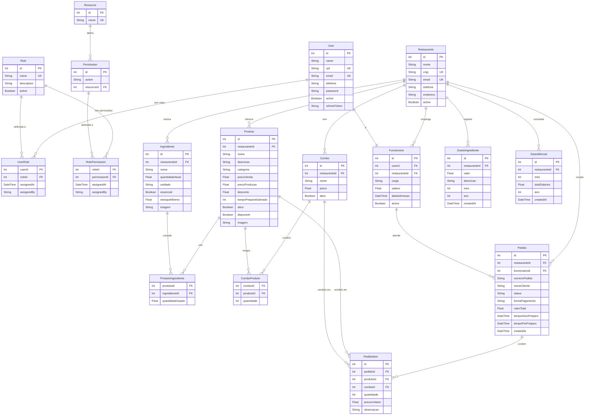

# Diagrama do Banco de Dados — Hamburgueria

## Como visualizar

### Opção 1 — mermaid.live (mais fácil, sem instalar nada)
1. Acesse **https://mermaid.live**
2. Apague o conteúdo do painel esquerdo
3. Cole o código Mermaid abaixo (só o bloco de código, sem os três backticks)
4. O diagrama aparece ao vivo no painel direito
5. Botão **Download SVG** ou **PNG** para salvar

### Opção 2 — draw.io com arquivo importado
1. Acesse **https://mermaid.live**, cole o código e clique em **Export → PNG/SVG**
2. No draw.io: **File → Import → From This Device** e selecione o SVG exportado

### Opção 3 — VS Code
Instale a extensão **Markdown Preview Mermaid Support** (`bierner.markdown-mermaid`) e pressione `Ctrl+Shift+V` neste arquivo.

---

