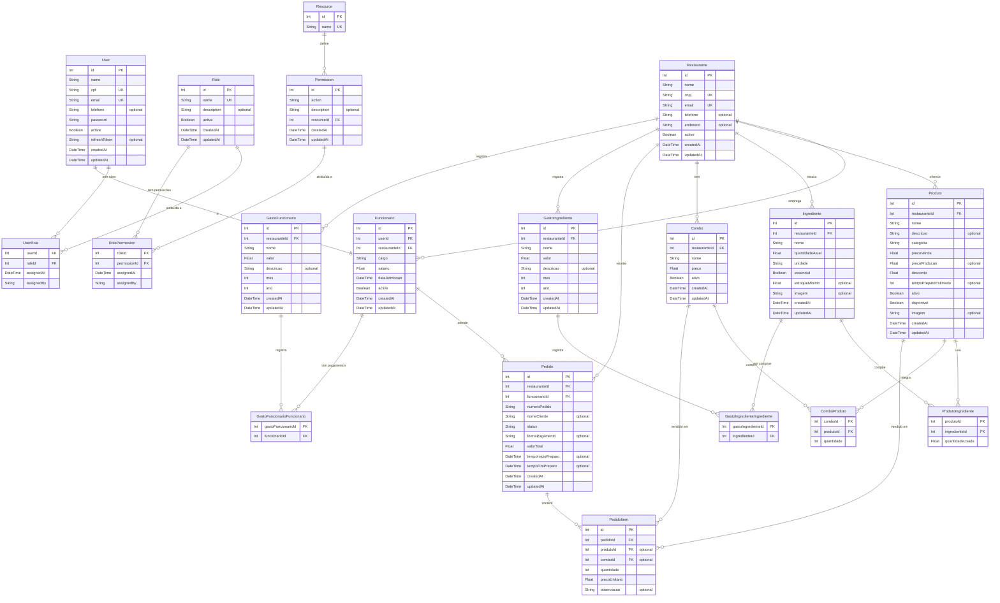

# Diagrama do Banco de Dados — Hamburgueria

## Como visualizar

### Opção 1 — mermaid.live (sem instalar nada)
1. Acesse **https://mermaid.live**
2. Apague o conteúdo do painel esquerdo
3. Cole o bloco Mermaid abaixo (sem os três backticks)
4. O diagrama aparece ao vivo no painel direito

### Opção 2 — VS Code
Instale a extensão **Markdown Preview Mermaid Support** (`bierner.markdown-mermaid`) e pressione `Ctrl+Shift+V` neste arquivo.

---

