```mermaid
erDiagram

  %% ── AUTENTICAÇÃO ─────────────────────────────────────────────
  User {
    Int      id           PK
    String   name
    String   cpf          UK
    String   email        UK
    String   telefone     "optional"
    String   password
    Boolean  active
    String   refreshToken "optional"
    DateTime createdAt
    DateTime updatedAt
  }

  Role {
    Int      id          PK
    String   name        UK
    String   description "optional"
    Boolean  active
    DateTime createdAt
    DateTime updatedAt
  }

  Resource {
    Int      id          PK
    String   name        UK
    String   description "optional"
    DateTime createdAt
    DateTime updatedAt
  }

  Permission {
    Int      id          PK
    Int      resourceId  FK
    String   action      "UK com resourceId"
    String   description "optional"
    DateTime createdAt
    DateTime updatedAt
  }

  UserRole {
    Int      userId     FK
    Int      roleId     FK
    DateTime assignedAt
    String   assignedBy
  }

  RolePermission {
    Int      roleId       FK
    Int      permissionId FK
    DateTime assignedAt
    String   assignedBy
  }

  %% ── RESTAURANTE / TENANT ─────────────────────────────────────
  Restaurante {
    Int      id       PK
    String   nome
    String   cnpj     UK
    String   email    UK
    String   telefone "optional"
    String   endereco "optional"
    String   logo     "optional"
    Boolean  active
    DateTime createdAt
    DateTime updatedAt
  }

  Funcionario {
    Int      id            PK
    Int      userId        FK "UK"
    Int      restauranteId FK
    Cargo    cargo         "ATENDENTE|COZINHEIRO|CAIXA"
    Float    salario
    DateTime dataAdmissao
    Boolean  active
    DateTime createdAt
    DateTime updatedAt
  }

  %% ── CARDÁPIO — INGREDIENTES ──────────────────────────────────
  Ingrediente {
    Int           id              PK
    Int           restauranteId   FK
    String        nome            "UK por restaurante"
    Float         quantidadeAtual
    UnidadeMedida unidade         "KG|G|LITRO|ML|UNIDADE"
    Boolean       essencial
    Float         estoqueMinimo   "optional"
    String        imagem          "optional"
    DateTime      createdAt
    DateTime      updatedAt
  }

  %% ── CARDÁPIO — PRODUTOS ──────────────────────────────────────
  Produto {
    Int              id                   PK
    Int              restauranteId        FK
    String           nome
    String           descricao            "optional"
    CategoriaProduct categoria            "PRINCIPAL|ACOMPANHAMENTO|BEBIDA|SOBREMESA"
    Float            precoVenda
    Float            precoProducao        "optional"
    Float            desconto
    Int              tempoPreparoEstimado "optional"
    Boolean          ativo
    String           imagem               "optional"
    DateTime         createdAt
    DateTime         updatedAt
  }

  ProdutoIngrediente {
    Int   produtoId       FK
    Int   ingredienteId   FK
    Float quantidadeUsada
  }

  %% ── CARDÁPIO — COMBOS ────────────────────────────────────────
  Combo {
    Int      id            PK
    Int      restauranteId FK
    String   nome          "UK por restaurante"
    String   descricao     "optional"
    Float    preco
    Int      tempoPreparo  "optional"
    Boolean  ativo
    DateTime createdAt
    DateTime updatedAt
  }

  ComboProduto {
    Int comboId    FK
    Int produtoId  FK
    Int quantidade
  }

  %% ── CARDÁPIO — PROMOÇÕES ─────────────────────────────────────
  Promocao {
    Int      id            PK
    Int      restauranteId FK
    String   nome
    Boolean  ativo
    String   descricao     "optional"
    Float    desconto      "optional"
    Int      tempoPreparo  "optional"
    DateTime createdAt
    DateTime updatedAt
  }

  PromocaoCombo {
    Int promocaoId FK
    Int comboId    FK
    Int quantidade
  }

  PromocaoProduto {
    Int promocaoId FK
    Int produtoId  FK
    Int quantidade
  }

  %% ── PEDIDOS ──────────────────────────────────────────────────
  Pedido {
    Int            id                 PK
    Int            restauranteId      FK
    Int            funcionarioId      FK
    String         numeroPedido       "UK por restaurante"
    String         nomeCliente        "optional"
    Int            mesa               "optional"
    StatusPedido   status             "ABERTO|EM_PREPARO|FINALIZADO|CANCELADO"
    FormaPagamento formaPagamento     "optional - DINHEIRO|CARTAO_CREDITO|CARTAO_DEBITO|PIX"
    Float          valorTotal
    DateTime       tempoInicioPreparo "optional"
    DateTime       tempoFimPreparo    "optional"
    DateTime       createdAt
    DateTime       updatedAt
  }

  PedidoItem {
    Int    id            PK
    Int    pedidoId      FK
    Int    produtoId     FK "optional"
    Int    comboId       FK "optional"
    Int    promocaoId    FK "optional"
    Int    quantidade
    Float  precoUnitario
    String observacao    "optional"
  }

  %% ── GASTOS (Table-Per-Type) ──────────────────────────────────
  %% Gasto é a tabela pai. O campo tipo discrimina o subtipo:
  %%   INGREDIENTE → existe linha em GastoIngrediente
  %%   FUNCIONARIO → existe linha em GastoFuncionario
  %%   GENERICO    → sem tabela filha (somente campos base)
  Gasto {
    Int       id            PK
    Int       restauranteId FK
    TipoGasto tipo          "INGREDIENTE|FUNCIONARIO|GENERICO"
    String    nome
    Float     valor
    String    descricao     "optional"
    Int       mes
    Int       ano
    DateTime  createdAt
    DateTime  updatedAt
  }

  GastoIngrediente {
    Int gastoId PK "FK → Gasto"
  }

  GastoIngredienteIngrediente {
    Int   gastoIngredienteId FK
    Int   ingredienteId      FK
    Float quantidade
  }

  GastoFuncionario {
    Int gastoId PK "FK → Gasto"
  }

  GastoFuncionarioFuncionario {
    Int gastoFuncionarioId FK
    Int funcionarioId      FK
  }

  %% ── RELAÇÕES ─────────────────────────────────────────────────

  %% Auth
  User            ||--o{ UserRole                    : "tem"
  Role            ||--o{ UserRole                    : "atribuída a"
  Role            ||--o{ RolePermission              : "tem"
  Permission      ||--o{ RolePermission              : "atribuída a"
  Resource        ||--o{ Permission                  : "define"

  %% Tenant
  Restaurante     ||--o{ Funcionario                 : "emprega"
  Restaurante     ||--o{ Ingrediente                 : "estoca"
  Restaurante     ||--o{ Produto                     : "oferece"
  Restaurante     ||--o{ Combo                       : "tem"
  Restaurante     ||--o{ Promocao                    : "tem"
  Restaurante     ||--o{ Pedido                      : "recebe"
  Restaurante     ||--o{ Gasto                       : "registra"

  %% Funcionário
  User            ||--|| Funcionario                 : "é"
  Funcionario     ||--o{ Pedido                      : "atende"
  Funcionario     ||--o{ GastoFuncionarioFuncionario : "incluído em"

  %% Cardápio — ingredientes
  Produto         ||--o{ ProdutoIngrediente          : "usa"
  Ingrediente     ||--o{ ProdutoIngrediente          : "compõe"

  %% Cardápio — combos
  Combo           ||--o{ ComboProduto                : "contém"
  Produto         ||--o{ ComboProduto                : "integra"

  %% Cardápio — promoções
  Promocao        ||--o{ PromocaoCombo               : "inclui"
  Combo           ||--o{ PromocaoCombo               : "em promoção"
  Promocao        ||--o{ PromocaoProduto             : "inclui"
  Produto         ||--o{ PromocaoProduto             : "em promoção"

  %% Pedidos
  Pedido          ||--o{ PedidoItem                  : "contém"
  Produto         ||--o{ PedidoItem                  : "vendido em"
  Combo           ||--o{ PedidoItem                  : "vendido em"
  Promocao        ||--o{ PedidoItem                  : "vendida em"

  %% Gastos — TPT
  Gasto           ||--o| GastoIngrediente            : "subtipo"
  Gasto           ||--o| GastoFuncionario            : "subtipo"
  GastoIngrediente         ||--o{ GastoIngredienteIngrediente : "registra"
  Ingrediente              ||--o{ GastoIngredienteIngrediente : "comprado em"
  GastoFuncionario         ||--o{ GastoFuncionarioFuncionario : "paga"
```

# Diagrama do Banco de Dados — Hamburgueria

## Como visualizar

### Opção 1 — mermaid.live (sem instalar nada)
1. Acesse **https://mermaid.live**
2. Apague o conteúdo do painel esquerdo
3. Cole o bloco Mermaid abaixo (sem os três backticks)
4. O diagrama aparece ao vivo no painel direito

### Opção 2 — VS Code
Instale a extensão **Markdown Preview Mermaid Support** (`bierner.markdown-mermaid`) e pressione `Ctrl+Shift+V` neste arquivo.

---

---

## O que mudou em relação à versão anterior

| # | Entidade | Mudança |
|---|----------|---------|
| 1 | `Restaurante` | Adicionado campo `logo` |
| 2 | `Funcionario` | `cargo` passou a ser enum (`ATENDENTE \| COZINHEIRO \| CAIXA`) |
| 3 | `Produto` | Removido campo `disponivel`; `categoria` passou a enum |
| 4 | `Combo` | Adicionados `descricao` e `tempoPreparo` |
| 5 | `Pedido` | Adicionado campo `mesa`; `status` e `formaPagamento` passaram a enum |
| 6 | `PedidoItem` | Adicionado `promocaoId` FK (promoção pode ser item de pedido) |
| 7 | `Gasto*` | Arquitetura completamente refeita: `GastoIngrediente` e `GastoFuncionario` deixaram de ser entidades raiz e passaram a ser subtipos da tabela pai `Gasto` (TPT — Table Per Type) |
| 8 | `GastoIngredienteIngrediente` | Adicionado campo `quantidade` |
| 9 | `Promocao` | Entidade nova — com join tables `PromocaoCombo` e `PromocaoProduto` |
| 10 | `Resource` | Adicionados `description`, `createdAt`, `updatedAt` |
| 11 | `Permission` | Restrição única composta `[action, resourceId]` documentada |
